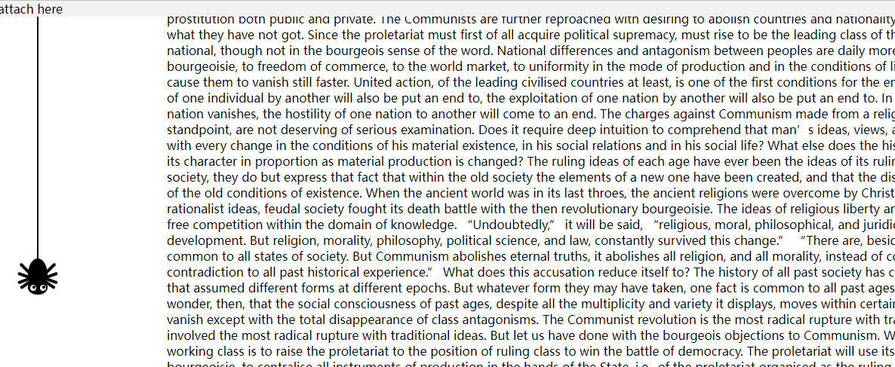

[](https://github.com/trekhleb/state-of-the-art-shitcode)
# progress-spider
A little spider to show your reading progress



This spider will show your reading progress and it will keep tracking your mouse.

## How to use

+ Install with npm

```
npm install progress-spider
```
+ Import
```js
import SpiderProgress from "progress-spider";
import "progress-spider/dist/style.css";
```

+ Call with params
```js
// The first two params are css selector
// The first params can be undefined. This will set the position attribute of the spider container into "fixed"
// and this is a config example:
config = {
    left: 20,
    bottom: 40,
    style: { // This will be apply on the container of spider
        top: 0
    }
}
SpiderProgress(attachSelector, trackTargetSelector, config)
```

## Live example

https://hci-hw.vercel.app/#/overview
